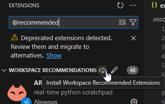

# Coder Extension Setup

## Table of Contents

- [Coder Extension Setup](#coder-extension-setup)
  - [Table of Contents](#table-of-contents)
  - [Introduction](#introduction)
  - [Setup Instructions](#setup-instructions)
  - [Notes](#notes)
  - [Final Words](#final-words)

## Introduction

This repository contains a simple explanation on using the BUas Coder setup.  
I highly recommend checking out Aaron's repository on [setting up git ssh on the server](https://github.com/AaronCiuffo245484/coder_ai_setup#), but I'll also mention it later where relevant.

This guide will focus on how to make your life easier when using the server, the main tool for that will be the **[VSCode Coder: Remote](https://marketplace.visualstudio.com/items?itemName=coder.coder-remote)**.  

Using this extension will allow you to use your local VSCode installation to connect to the server, allowing for features like Copilot, local extensions and IntelliSense, and a generally more responsive experience.

## Setup Instructions

1. Install the [VSCode Coder: Remote](https://marketplace.visualstudio.com/items?itemName=coder.coder-remote) extension.
2. Once installed, a new icon should appear in the sidebar, click it:  
    
3. Authenticate with your Coder account by entering `http://coder.ai.buas.nl` in the URL prompt, this will open a browser window where you can copy the API key and paste it back into VSCode.  
4. Success! You will now see your workspaces and be able to connect to them directly from VSCode.  

Additional setup (optional but recommended!):

5. Run the workspace of your choosing, or create one by clicking the `+` button in the top right of the sidebar (this will open a browser window).
6. Check out Aaron's git setup, I highly recommend following his instructions, as manually downloading/uploading is a lot more tedious than just using git.
    - [Aaron's Git Setup](https://github.com/AaronCiuffo245484/coder_ai_setup)
    - Tip: You can simply drag and drop files from your local machine into the VSCode file explorer to upload them to the server. Additionally, to download, you can right-click a file and select "Download".
7. Once you have your git repo set up, I also recommend installing a handful of extensions.  
I made a list of extensions that I personally use: [./extensions.json](./extensions.json).  
To use this file, in the root of your project's directory (`/home/y2a/`), create a `.vscode/` folder and place the `extensions.json` file in there.  
Then, in VSCode, head to the extensions tab and install the recommended extensions (see image).
  
You can add extensions by finding them in the marketplace and clicking install, then adding them to the `extensions.json` file so they persist across autostops.

Success! You can now use all your familiar extensions and settings in VSCode while running your code on the server.  

## Notes

The workspace autostops after 24 hours of the workspace starting, extended by 1 hour after the last activity in the workspace.  
This autostop causes all files outside of the working directory (`/home/y2a/`) to be deleted, and file permisions to be reset.  

This causes issues with:

- pip installs (setting up a `requirements.txt` or similar is recommended)
- git ssh setup (running Aaron's script again will fix this, you won't have to add the key to your account again)
- git global config (you might have to set your name/email again)
- vscode extensions (install them in the workspace again just like defined above)

## Final Words

If you have any questions, run into issues or have any notes, feel free to reach out to me on Teams or whatever platform you prefer.  
Of course you can always submit a PR if you feel like something is missing or could be improved.
